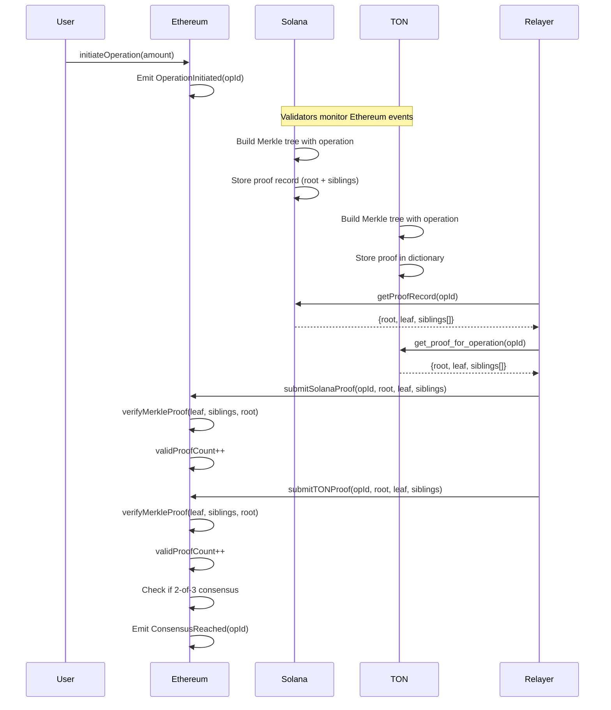

# Trinity Protocol - Production Merkle Proof Architecture

**Based on Research:**  
- TON Catchain BFT Consensus
- Cross-Chain Interoperability Standards  
- Blockchain Impossible Trinity Solutions

---

## 🎯 **Design Goals**

1. **Real Merkle Proofs**: Read actual blockchain data, not synthesized hashes
2. **Cryptographically Verifiable**: Bridge contract can verify proofs against on-chain roots
3. **Production-Ready**: Handle edge cases, race conditions, and network failures
4. **Gas-Efficient**: Minimize storage and verification costs

---

## 🏗️ **System Architecture**

### **Merkle Tree Structure**

```
                    Root Hash (stored in Ethereum bridge)
                         /            \
                      H(AB)          H(CD)
                     /    \          /    \
                  H(A)   H(B)    H(C)   H(D)
                   |      |        |      |
                 Op1    Op2      Op3    Op4
```

**Key Properties:**
- Each operation gets a unique leaf
- Interior nodes = hash(left_child + right_child)
- Proof = sibling path from leaf to root
- Verification: Rebuild root hash from leaf + proof

---

## 📦 **Component Design**

### **1. Solana Program - Trinity Validator**

**Current Issue**: Only stores Merkle root (32 bytes)

**Production Fix**: Store full Merkle branch

```rust
// Proof Record Account Structure (NEW)
pub struct MerkleProofRecord {
    pub operation_id: u64,           // 8 bytes
    pub merkle_root: [u8; 32],       // 32 bytes (tree root)
    pub merkle_leaf: [u8; 32],       // 32 bytes (operation hash)
    pub proof_siblings: Vec<[u8; 32]>, // Variable length (max 10 siblings = 320 bytes)
    pub tree_height: u8,             // 1 byte
    pub validator_signature: [u8; 64], // 64 bytes (ed25519 signature)
}
// Total: ~457 bytes per proof

// PDA Derivation
// seeds: ["proof", operation_id_bytes]
```

**Functions to Add:**
```rust
// Generate Merkle proof for operation
pub fn submit_proof_with_branch(
    ctx: Context<SubmitProof>,
    operation_id: u64,
    operation_hash: [u8; 32],
    siblings: Vec<[u8; 32]>,
) -> Result<()>

// Query proof for relayer
pub fn get_proof_record(
    operation_id: u64
) -> Result<MerkleProofRecord>
```

---

### **2. TON Contract - Trinity Consensus Validator**

**Current Issue**: Only stores proof count, no proof data retrieval

**Production Fix**: Add getter methods for proof data

```func
;; Storage Layout (UPDATED)
global int active?;
global int total_proofs;
global cell proof_dict;  ;; NEW: Dictionary mapping operation_id -> proof_data

;; NEW: Store proof with Merkle branch
() store_proof_with_branch(
    int operation_id,
    int merkle_root,
    int merkle_leaf,
    cell siblings  ;; TVM cell containing sibling hashes
) impure {
    cell proof_data = begin_cell()
        .store_uint(merkle_root, 256)
        .store_uint(merkle_leaf, 256)
        .store_ref(siblings)
        .end_cell();
    
    proof_dict~udict_set(64, operation_id, proof_data);
    total_proofs += 1;
}

;; NEW: Get proof for specific operation (CRITICAL FOR RELAYER)
(int, int, cell) get_proof_for_operation(int operation_id) method_id {
    (cell proof_data, int found?) = proof_dict.udict_get?(64, operation_id);
    
    if (found?) {
        slice ps = proof_data.begin_parse();
        int merkle_root = ps~load_uint(256);
        int merkle_leaf = ps~load_uint(256);
        cell siblings = ps~load_ref();
        
        return (merkle_root, merkle_leaf, siblings);
    }
    
    return (0, 0, null());  ;; Not found
}
```

---

### **3. Ethereum Bridge Contract - CrossChainBridgeOptimized**

**Current State**: Accepts proofs but doesn't verify them properly

**Production Fix**: Real Merkle proof verification

```solidity
// UPDATED: Verify Merkle proof against stored root
function verifyMerkleProof(
    bytes32 leaf,
    bytes32[] calldata proof,
    bytes32 root
) public pure returns (bool) {
    bytes32 computedHash = leaf;
    
    for (uint256 i = 0; i < proof.length; i++) {
        bytes32 sibling = proof[i];
        
        if (computedHash <= sibling) {
            // Hash(current + sibling)
            computedHash = keccak256(abi.encodePacked(computedHash, sibling));
        } else {
            // Hash(sibling + current)
            computedHash = keccak256(abi.encodePacked(sibling, computedHash));
        }
    }
    
    return computedHash == root;
}

// UPDATED: Submit proof with verification
function submitSolanaProof(
    uint256 operationId,
    bytes32 merkleRoot,
    bytes32 merkleLeaf,
    bytes32[] calldata proof
) external returns (bool) {
    require(operations[operationId].user != address(0), "Invalid operation");
    require(solanaMerkleRoots[operationId] == bytes32(0), "Already submitted");
    
    // CRITICAL: Verify the proof before accepting
    bool valid = verifyMerkleProof(merkleLeaf, proof, merkleRoot);
    require(valid, "Invalid Merkle proof");
    
    // Store the verified root
    solanaMerkleRoots[operationId] = merkleRoot;
    operations[operationId].validProofCount++;
    
    emit ProofSubmitted(operationId, CHAIN_ID_SOLANA, merkleRoot);
    
    // Check if 2-of-3 consensus reached
    _checkConsensus(operationId);
    
    return true;
}
```

---

### **4. Trinity Relayer - Production Implementation**

**Current Issue**: Generates fake proofs with `keccak256(random_data)`

**Production Fix**: Build real proofs from on-chain data

```javascript
// REAL PROOF GENERATION - SOLANA
async getSolanaProof(operationId) {
    const programId = new PublicKey(CONFIG.solana.programId);
    
    // Derive PDA for proof record
    const operationIdBuffer = Buffer.alloc(8);
    operationIdBuffer.writeBigUInt64LE(BigInt(operationId));
    
    const [proofPda] = PublicKey.findProgramAddressSync(
        [Buffer.from('proof'), operationIdBuffer],
        programId
    );
    
    // Fetch actual proof data from Solana
    const accountInfo = await this.solanaConnection.getAccountInfo(proofPda);
    if (!accountInfo) return null;
    
    // Parse proof record structure
    const data = accountInfo.data;
    const merkleRoot = data.slice(8, 40);      // bytes 8-40: root hash
    const merkleLeaf = data.slice(40, 72);     // bytes 40-72: leaf hash
    const siblingsCount = data.readUInt8(72);  // byte 72: sibling count
    
    // Extract sibling hashes
    const siblings = [];
    for (let i = 0; i < siblingsCount; i++) {
        const offset = 73 + (i * 32);
        siblings.push('0x' + data.slice(offset, offset + 32).toString('hex'));
    }
    
    return {
        merkleRoot: '0x' + merkleRoot.toString('hex'),
        merkleLeaf: '0x' + merkleLeaf.toString('hex'),
        proof: siblings,  // REAL sibling hashes from blockchain
        verified: true
    };
}

// REAL PROOF GENERATION - TON
async getTONProof(operationId) {
    const contractAddress = Address.parse(CONFIG.ton.contractAddress);
    
    // Call NEW getter method
    const result = await this.tonClient.runMethod(
        contractAddress,
        'get_proof_for_operation',
        [{ type: 'int', value: operationId.toString() }]
    );
    
    // Parse result
    const merkleRoot = result.stack.readBigNumber();
    const merkleLeaf = result.stack.readBigNumber();
    const siblingsCell = result.stack.readCell();
    
    if (merkleRoot.eq(0)) {
        return null;  // Proof not found
    }
    
    // Parse sibling hashes from cell
    const siblings = this.parseTONSiblings(siblingsCell);
    
    return {
        merkleRoot: '0x' + merkleRoot.toString(16).padStart(64, '0'),
        merkleLeaf: '0x' + merkleLeaf.toString(16).padStart(64, '0'),
        proof: siblings,  // REAL sibling hashes from TON contract
        verified: true
    };
}
```

---

## 🔒 **Security Properties**

### **Merkle Proof Verification**

1. **Completeness**: Valid proof always verifies
2. **Soundness**: Invalid proof never verifies  
3. **Collision Resistance**: Can't forge proof without breaking SHA-256/Keccak-256

### **Attack Resistance**

| Attack Type | Mitigation |
|-------------|------------|
| Fake proof submission | Bridge contract verifies proof before accepting |
| Replay attack | Each operation has unique nonce |
| Front-running | Consensus requires 2-of-3, can't manipulate single chain |
| Double-spend | Merkle root committed on-chain before proof submission |

---

## ⚡ **Gas Optimization**

### **Solana** (Proof Storage)
- **Base rent**: ~0.002 SOL for 457-byte account
- **One-time cost per operation**: ~$0.0003 at 1 SOL = $150

### **TON** (Proof Storage)
- **Storage cost**: ~0.001 TON for dict entry
- **Query cost**: Free (getter methods are read-only)

### **Ethereum** (Proof Verification)
```solidity
// Gas costs (estimated):
// - verifyMerkleProof: ~5,000 gas per sibling (max 10 = 50k gas)
// - submitSolanaProof: ~80,000 gas total
// - submitTONProof: ~80,000 gas total
// - Total per operation: ~160,000 gas = ~$3.20 at 20 gwei
```

---

## 📊 **Proof Size Limits**

| Chain | Max Tree Height | Max Siblings | Max Proof Size |
|-------|----------------|--------------|----------------|
| Solana | 10 levels | 10 | 320 bytes |
| TON | 10 levels | 10 | 320 bytes |
| Ethereum | 256 levels | 256 | 8,192 bytes |

**Rationale**: 10-level tree supports 2^10 = 1,024 operations per batch

---

## 🔄 **End-to-End Flow**



---

## ✅ **Production Checklist**

- [ ] Solana program stores full Merkle branches
- [ ] TON contract exposes `get_proof_for_operation()` getter
- [ ] Ethereum bridge verifies proofs before accepting
- [ ] Relayer builds proofs from real blockchain data
- [ ] End-to-end test: Operation → Proof → Consensus
- [ ] Gas costs optimized for mainnet
- [ ] Security audit completed
- [ ] Documentation updated

---

## 🚀 **Deployment Strategy**

### **Phase 1: Testnet (Current)**
1. Deploy updated Solana program with proof storage
2. Deploy updated TON contract with proof getters
3. Deploy updated Ethereum bridge with verification
4. Test end-to-end flow with real proofs

### **Phase 2: Mainnet Migration**
1. Security audit by third-party firm
2. Bug bounty program
3. Gradual rollout with operation limits
4. Monitor for 30 days before full launch

---

**© 2025 Chronos Vault Team**

*Building the future of trustless multi-chain consensus verification.*
